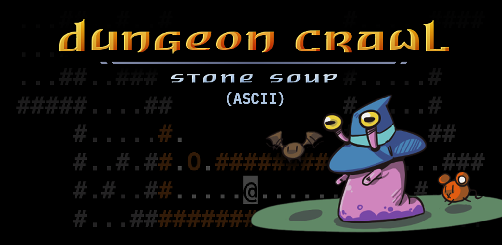

# Dungeon Crawl Stone Soup ASCII

An unofficial Android port of [Dungeon Crawl Stone Soup](https://crawl.develz.org/), focused on the classic ASCII console experience — no tiles, no SDL2, just terminal-rendered text on your phone.

Currently bundles **DCSS 0.34.1**.

## Download

APK releases are available on the
[GitHub Releases page](https://github.com/noisewar-cookie/dcss-ascii-android/releases).

## Features

- Authentic ASCII rendering — every glyph as it appears in upstream DCSS
- Portrait-optimized HUD for mobile screens
- On-screen keyboard tuned for DCSS keybindings
- No ads, no analytics, no network access (see [Privacy Policy](privacy.html))
- Open source under GPL-2.0

## About

This is a fork of [michaelbarlow7/dungeon-crawl-android](https://github.com/michaelbarlow7/dungeon-crawl-android), updated from DCSS 0.29.1 to 0.34.1. Full credit to Michael Barlow for the original Android console port and JNI adapter architecture.

For build instructions, architecture details, and contribution information, see the [project README on GitHub](https://github.com/noisewar-cookie/dcss-ascii-android#readme).

## Links

- [Source on GitHub](https://github.com/noisewar-cookie/dcss-ascii-android)
- [Changelog](https://github.com/noisewar-cookie/dcss-ascii-android/blob/master/CHANGELOG.md)
- [Privacy Policy](privacy.html)
- [License (GPL-2.0)](https://github.com/noisewar-cookie/dcss-ascii-android/blob/master/LICENSE)
